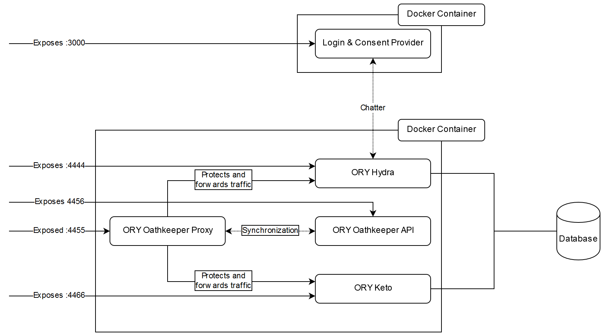

# ORY Ecosystem Deployment Examples

This repository contains deployment examples and templates for the ORY Ecosystem. This repository does not contain
examples for the [ORY Editor](https://github.com/ory/editor), but ORY Hydra, ORY Oathkeeper, and ORY Keto.

## Examples

### Backwards Compatible Template for ORY Hydra < 1.0.0

This example sets up ORY Hydra, ORY Oathkeeper, and ORY Keto in a way that makes the deployment fully backwards compatible
with the access control concept of ORY Hydra < 1.0.0. It includes the Warden API, the Waden Group API, and protects
ORY Hydra's endpoints using OAuth 2.0 Access Tokens and Access Control Policies.

You should use this example only if you are upgrading from ORY Hydra < 1.0.0 and rely on its internal access control.

#### Running the Example

Run this example with:

```
$ make start-hydra-bc
```

Please be patient. The system has to boot a PostgreSQL database, execute SQL migrations for two services, then create
several configuration items. This might take up to 5 minutes, depending on your system. While you wait, you may want
to check `docker logs hydra-bc_postgresd_1`, `docker logs hydra-bc_keto-migrate_1`, `docker logs hydra-bc_hydra-migrate_1`,
and `docker logs hydra-bc_services_1`.

Once you are confident that everything is loaded (you're not seeing any error messages), try to run:

```
$ curl http://localhost:4444/clients
$ curl http://localhost:4466/policies
$ curl http://localhost:4456/rules
```

To perform - for example - the OAuth 2 Authorize Code Flow, install ORY Hydra >= 1.0.0 locally and do:

```
$ hydra token user --client-id example-auth-code --client-secret secret --endpoint http://localhost:4455
```

You can achieve the same thing if you run the ORY Hydra CLI from Docker, but you will have to figure out yourself how
to connect the containers... ;)

#### Architecture



This example has three docker containers:

* A PostgreSQL database for ORY Hydra and ORY Keto.
* Our reference [login and consent provider](https://github.com/ory/hydra-login-consent-node) exposed at port `3000`.
* A docker container runs `supervisord` which is configured to run these services:
  * `hydra serve --dangerous-force-http` which is exposed directly (without access control) at port `4444`.
  * `oathkeeper serve proxy` which is exposed at port `4455`. You can access all other services through this port, but must
  pass access control using OAuth 2.0 Access Tokens. This endpoint resembles ORY Hydra prior to 1.0.0.
  * `oathkeeper serve api` exposed at port `4456`. This endpoint lets you manage ORY Oathkeeper if you need to. Be aware
  that this service is not configured to use the database. Every time you restart the container, you will have to redo
  all changes made.
  * `keto serve` exposed at port `4466` without access control.
  * A script that loads all configuration items from the `./config` directory and imports ORY Hydra OAuth 2.0 Clients, ORY Keto Access Control Policies, and
  ORY Oathkeeper Access Rules to each respective service.

If you intend to upgrade an existing database installation, please read the [ORY Hydra Upgrade Guide](https://github.com/ory/hydra/blob/master/UPGRADE.md)
to learn how to achieve that.

It is recommended to check out the configuration items in the `./config` directory as it will probably also help you
understand the system better.

The `./supervisord.conf` contains the configuration for `supervisord`. You can check it out if you want to learn how
each service environment is set up. The supervisor set up needs a few plugins (fail on repeated errors and prefix output logs)
in order to work properly. We'd like to move away from `supervisord` at some point, but for now it's the best tool we
have for the job. On the downside, `python3` and `pip` are installed to execute the plugins.

If you intend to run a system based on this example in production, do not expose any port other than `4455` to the open internet.
All other ports are *completely unprotected*.

## Development

In case you wish to develop one of the projects and test them out with the examples here, first build the docker images
for each project:

```
docker build -t oryd/hydra:dev $GOPATH/src/github.com/ory/hydra/
docker build -t oryd/oathkeeper:dev $GOPATH/src/github.com/ory/oathkeeper/
docker build -t oryd/keto:dev $GOPATH/src/github.com/ory/keto/
```

then run Docker Compose in the example you would wish to test and set the version tags to `dev`:

```
$ cd some/example
$ HYDRA_VERSION=dev KETO_VERSION=dev OATHKEEPER_VERSION=dev docker-compose up --build -d
```